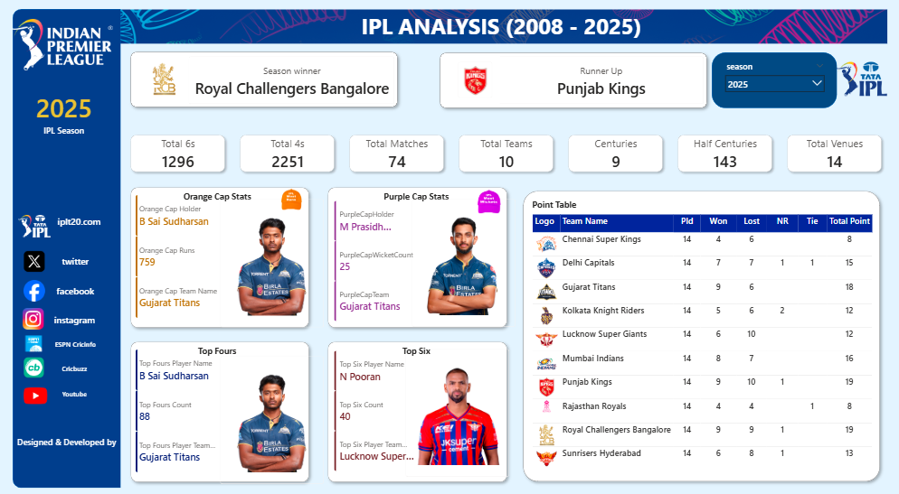

# IPL Analysis Dashboard (2008–2025)

Dashboard interaktif berbasis **Power BI** untuk menganalisis data Indian Premier League (IPL) dari musim 2008 sampai 2025. Dashboard ini menampilkan ringkasan performa musim, pemenang kompetisi, statistik Orange Cap, Purple Cap, top fours, top six, serta klasemen/point table tim.

## Preview Dashboard

> Tambahkan screenshot dashboard pada folder `screenshots/`, lalu ubah nama file di bawah ini sesuai screenshot yang digunakan.



## Tujuan Project

Project ini dibuat sebagai portofolio data analyst untuk menunjukkan kemampuan dalam:

- membangun dashboard interaktif menggunakan Power BI;
- membuat visualisasi KPI dan statistik olahraga;
- mengolah data musim IPL dari tahun ke tahun;
- menyajikan informasi performa tim dan pemain secara ringkas;
- menggunakan slicer/filter untuk eksplorasi data berdasarkan musim IPL.

## Tools yang Digunakan

- **Power BI Desktop**
- **Power Query**
- **DAX**
- Dataset IPL

## Fitur Dashboard

Dashboard ini memiliki beberapa komponen utama:

### 1. Season Filter

Filter/slicer untuk memilih musim IPL tertentu, sehingga pengguna dapat melihat statistik berdasarkan tahun atau season yang dipilih.

### 2. Summary KPI

Menampilkan ringkasan utama seperti:

- total matches;
- total teams;
- total venues;
- total 4s;
- total 6s;
- winner season;
- runner up.

### 3. Orange Cap Stats

Menampilkan pemain dengan performa batting terbaik pada musim tertentu, termasuk:

- Orange Cap Holder;
- jumlah runs;
- nama tim;
- gambar/foto pemain jika tersedia.

### 4. Purple Cap Stats

Menampilkan pemain dengan performa bowling terbaik pada musim tertentu, termasuk:

- Purple Cap Holder;
- jumlah wicket;
- nama tim;
- gambar/foto pemain jika tersedia.

### 5. Top Fours & Top Six

Menampilkan pemain dengan jumlah boundary tertinggi, yaitu:

- Top Fours Player;
- jumlah fours;
- Top Six Player;
- jumlah sixes;
- nama tim pemain.

### 6. Point Table

Menampilkan klasemen tim berdasarkan data performa pertandingan, seperti:

- matches played;
- matches won;
- matches lost;
- tie played;
- no result played;
- total point.

## Data yang Digunakan

Dataset yang digunakan berisi data IPL, antara lain:

- data pertandingan per musim;
- data tim;
- data pemenang dan runner up;
- statistik batting dan bowling;
- data points table;
- informasi pemain dan logo/gambar pendukung.

> Catatan: Jika dataset asli tidak dapat dibagikan karena lisensi atau ukuran file, sertakan hanya sample data atau tuliskan sumber dataset pada bagian ini.

## Insight yang Dapat Dianalisis

Beberapa insight yang dapat diperoleh dari dashboard ini:

1. Melihat pemenang dan runner up IPL pada setiap musim.
2. Membandingkan performa tim berdasarkan jumlah menang, kalah, tie, dan total poin.
3. Mengidentifikasi pemain dengan kontribusi batting terbaik melalui Orange Cap, total runs, top fours, dan top sixes.
4. Mengidentifikasi pemain dengan kontribusi bowling terbaik melalui Purple Cap dan jumlah wicket.
5. Melihat perubahan jumlah pertandingan, tim, dan venue dari musim ke musim.

## Struktur Repository

```text
ipl-powerbi-portfolio/
│
├── README.md
├── powerbi/
│   └── IPL_Analysis_Dashboard.pbix
│
├── screenshots/
│   ├── dashboard-preview.png
│   ├── page-1-overview.png
│   └── page-2-detail.png
│
├── dataset/
│   └── sample_data.csv
│
└── assets/
    └── logo-or-supporting-images.png
```

## Cara Membuka Dashboard

1. Download atau clone repository ini.
2. Buka file berikut menggunakan Power BI Desktop:

```text
powerbi/IPL_Analysis_Dashboard.pbix
```

3. Gunakan slicer/filter musim IPL untuk melihat analisis berdasarkan season.

## Catatan Portofolio

File `.pbix` dapat menyimpan data di dalamnya. Sebelum repository dibuat public, pastikan data yang digunakan aman untuk dibagikan. Jika data tidak boleh dibagikan, cukup upload screenshot dashboard dan README, lalu jangan upload file `.pbix` atau dataset asli.

## Author

**Hasbi Azi Faisya**  
Data Analyst Portfolio
